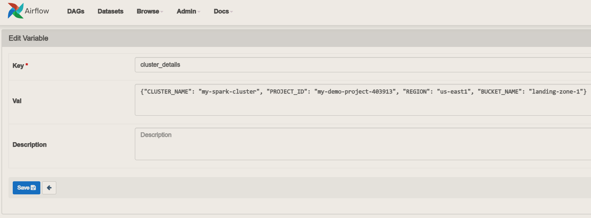
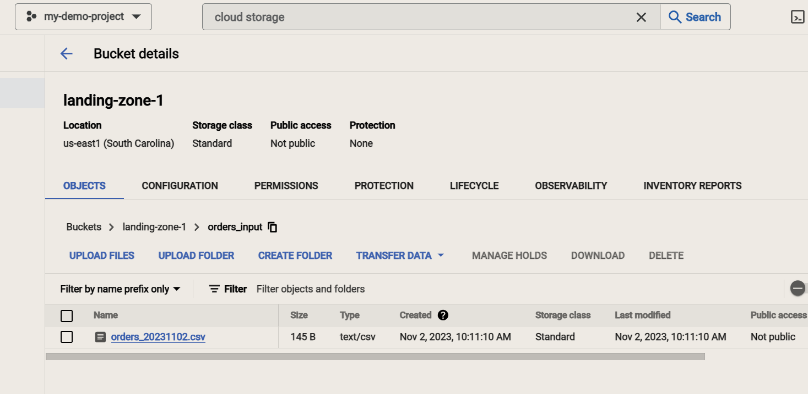
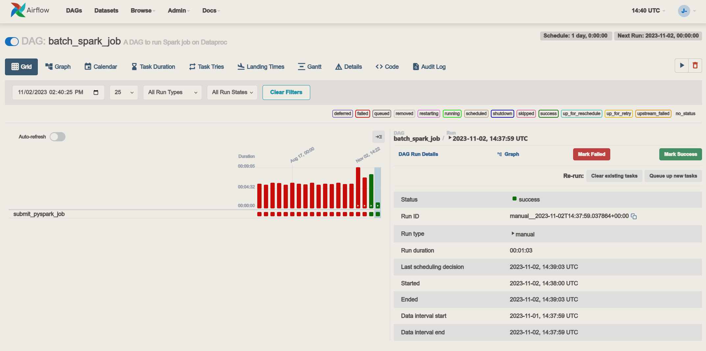
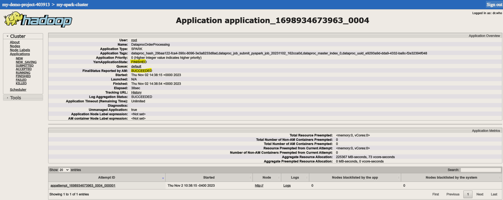
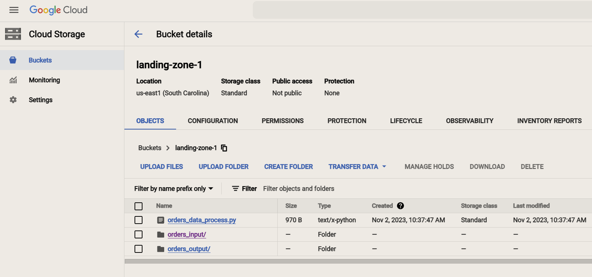
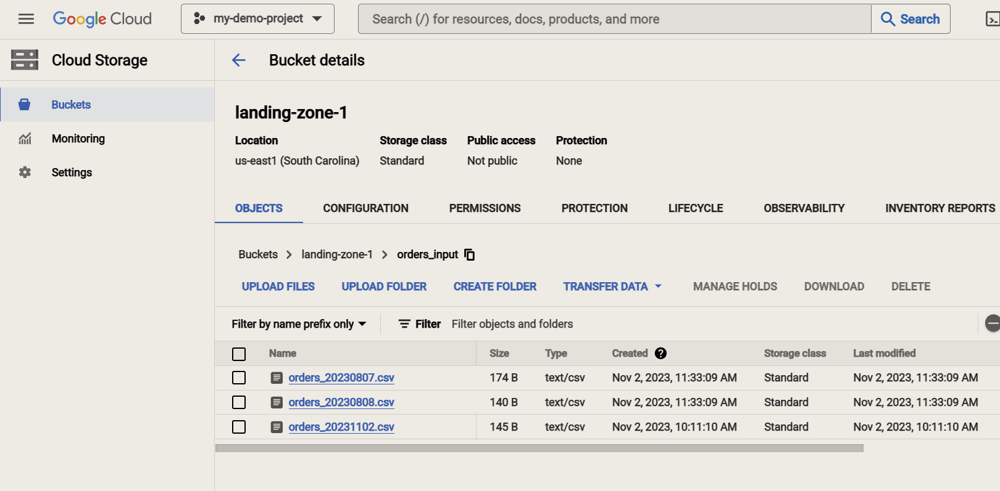
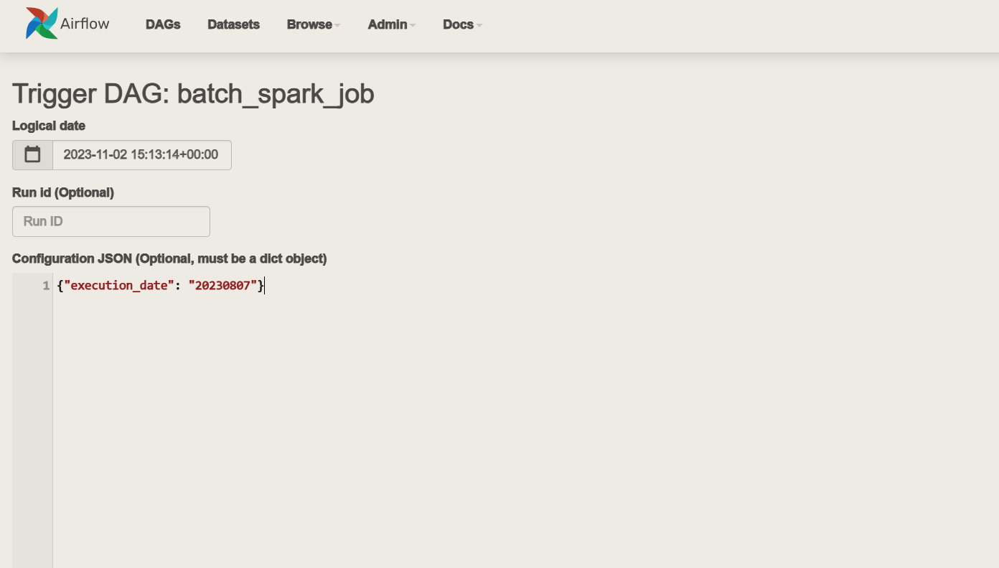
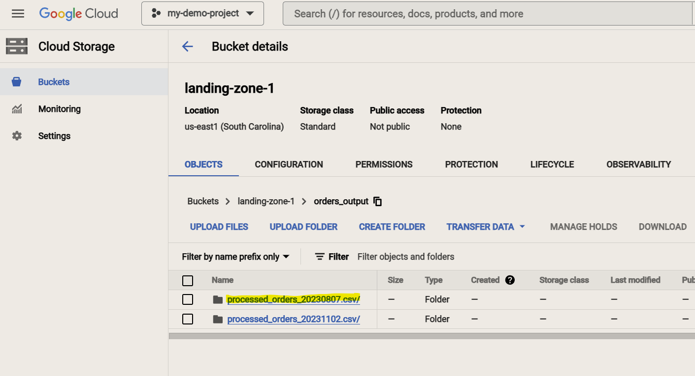

# Airflow Pipeline with PySpark using Google Cloud

## Introduction

This project primarily aims to showcase a key Airflow feature that employs `Jinja` templates for obtaining Airflow configurations. The utilization of Jinja templates serves as a solution to address the typical data backfilling challenges encountered in data pipelines, where data often arrives late for processing, necessitating manual intervention.

The Airflow Directed Acyclic Graph (DAG) implemented in this project assumes that data is typically received for processing on a daily basis. Furthermore, the program is designed to facilitate the input of custom dates for backfilling purposes, thus providing a solution for handling this common scenario.

## Prerequisite

- This project is completed with Google Cloud services.
- Create a new project named `my-demo-project`, record the project ID.
- Create a `Composer` environment named `my-airflow-cluster` and upload `airflow_orders_job.py` into the `DAGs folder`.
- Create a `Dataproc` cluster named `my-spark-cluster` in the region `us-east1`.
- Create a bucket in `Google Cloud Storage` named `landing-zone-1` and upload `orders_data_process.py` into it.
- Create a sub-folder named `orders_input` under `landing-zone-1`.

## Scenario 1 - Daily data process

1. Configure sensitive information using Airflow Variables.

    Go to `Admin` -> `Variables`. Create a new record. Name the `Key` cluster_details, and copy the content of `cluster_details.json` (included in the project) into the `Val` as shown below. Note: you may need to change some of values according to your cluster configurations, for example, the value of `PROJECT_ID`.

    

2. Change the filename of a dataset.

    In order for the Airflow DAG to pick up the data and process, it is required that you manually change the data `orders_20231102.csv` to your current date `orders_<yyyymmdd>.csv`. (Note: You need only change the filename of one file)

3. Upload the dataset (where the filename has just been modified) into `orders_input` folder.

    

4. Trigger the dag.

   - The success of running the DAG:

        

   - Perspective from `Yarn` resource manager:

        

   - The output folder:

        

## Scenario 2 - Data Backfilling

1. Upload the other datasets `orders_20230807.csv` and `orders_20230808.csv` into `orders_input` folder

    

2. Trigger the dag selecting `Trigger DAG w/ config` option and enter a json string as follows. Note: This project can only accept one backfilling date at a time. Therefore, you need to give a different date for different backfilling data.

    

   - The output result:

        

